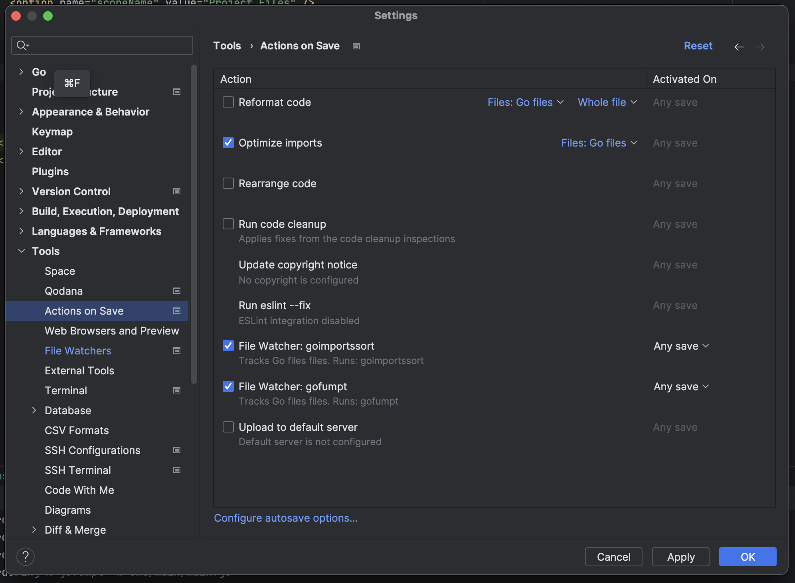

# Repro for File Watchers running out-of-order

Provides a reproducible for a bug in intellij IDEs which is driving our dev 
team a bit batty...

This set up requires:

- `GoLand`
- `go@1.21`
- [`goimportssort`]() - automated import sorting that matches _user expectations_
- [`gofumpt`](https://github.com/mvdan/gofumpt) - stricter Go formatting

## Setup

- Download and install the aforementioned formatting binaries.
- Import [watchers.xml](docs/watchers.xml) and enable the File Watchers in GoLand
- Ensure "optimize imports" is selected as well, as this tool removes _unused_ imports, which the others don't handle...
- Open `cmd/main/main.go`
- Create a newline and hit save
- Have sadness as the binaries fight over each other as the files change.

## Testing Notes

- Ironically, trying this repro on my Mac (M2, Sonoma), on first save it seems to work.
- If you then revert and attempt the same flow again it fails.
  - Optimize imports runs as soon as you hit enter.
  - Then on saving the file only the output of `goimportssort` is saved to disk.
  - `gofumpt` runs, you can sometimes see your screen flicker with the correct output, but then gets overwritten by the outputs from `goimportssort`.
- The second flow is what we have experiencing daily.

## Outcomes

- Got: [got.go](_examples%2Fgot.go)
- Expected: [expected.go](_examples%2Fexpected.go)

[YouTube Screencast](https://youtu.be/gBapXssVWJE)